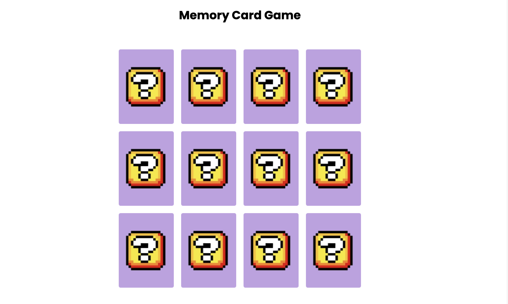

# Memory Card Game

A simple Memory Card Game built with HTML, CSS, and JavaScript.



## Table of Contents

- [About the Game](#about-the-game)
- [Features](#features)
- [How to Play](#how-to-play)
- [Installation](#installation)
- [Usage](#usage)
- [Contributing](#contributing)
- [License](#license)

## About the Game

Memory Card Game is a classic card matching game where players need to find matching pairs of cards. This game is built using HTML, CSS, and JavaScript, and it features a simple and intuitive user interface.

## Features

- 12 cards (6 pairs) to match
- Card flipping animation
- Win detection

## How to Play

1. **Objective**: The goal of the game is to find all matching pairs of cards.
2. **Gameplay**:
   - Click on a card to flip it.
   - Click on another card to try to find its matching pair.
   - If the cards match, they will stay flipped.
   - If the cards do not match, they will flip back over.
3. **Winning**:
   - The game is won when all cards are matched.

## Installation

1. Clone the repository:

   ```bash
   git clone https://github.com/yourusername/memory-card-game-final.git
   ```

2. Navigate to the project directory:

   ```bash
   cd memory-card-game
   ```

## Usage

1. Open the `index.html` file in a web browser to start the game.
2. Click on the cards to flip them and try to find all matching pairs.

## Contributing

Pull requests are welcome. For major changes, please open an issue first to discuss what you would like to change.

## License

This project is licensed under the MIT License. See the [LICENSE](./LICENSE) file for details.
